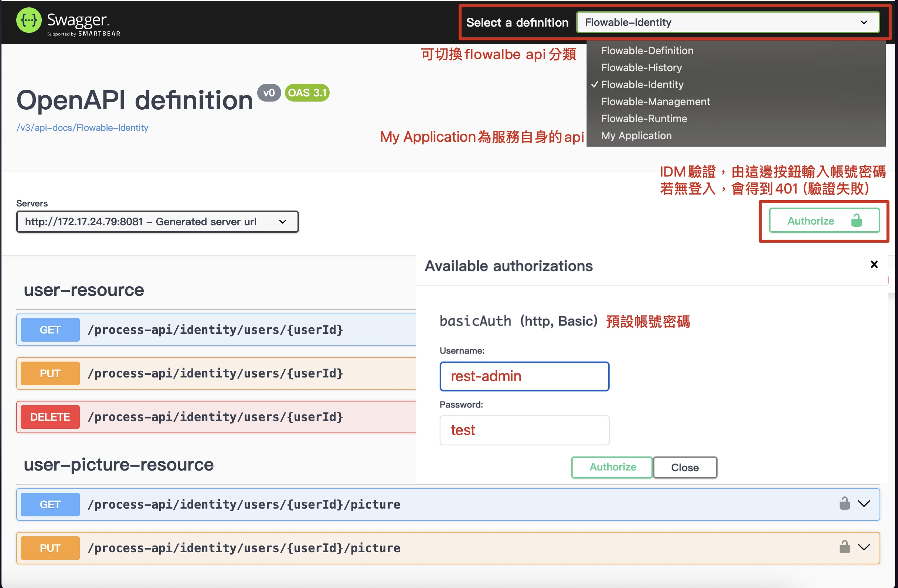

# Flowable 平台程式與架構說明

本文件同步 `flowable` 目前的程式碼（develop 分支，HEAD `2151a03b`，2025-11-20），以便快速理解模組拆分、關鍵元件、建置鏈與操作流程。所有內容均可由
Git 操作記錄、現況程式碼與 Gradle 設定交叉驗證。

## 1. 專案概覽

- **目標**：將 Flowable 7.2.0（Engine、REST、IDM）包裝成可控的 API 平台，並串接 BT 既有元件（監控、Eureka、Bridge
  Dispatcher、Logging）。
- **模組**：Gradle multi-module，包含 `boot:flowable`（可執行 Jar 與配置打包）、`web`（HTTP / 安全 / 日誌配件）、
  `flowable-process`（流程引擎與資料層）。
- **執行環境**：Java 21、Spring Boot 3.5.6、Undertow 2.3.19.Final、Oracle DB（HikariCP）。
- **部署模式**：本機使用 `bootRun` 與 `-Denv=<profile>`；Jenkins pipeline 觸發
  `build / check / dependency-check / sonar / deploy`；`gradle/deploy` 內建 SSH 自動化推送至 DEV（172.17.24.79，flowuser）。
- **觀測性**：Log4j2 YAML 定義 Application / JMS / LOG-AGENT / HTTP-EXCHANGE 多個 appends，Actuator，Undertow
  tuning 與 access log 皆以 YAML 管理。

## 2. 技術棧與版本

| 類別         | 版本 / 套件                                                       | 說明                                                                                                               |
|------------|---------------------------------------------------------------|------------------------------------------------------------------------------------------------------------------|
| 語言 / 框架    | Java 21、Spring Boot 3.5.6、Spring Dependency Management 1.1.7  | `java` toolchain 鎖定 JDK，所有子專案預設 `java-library` + `org.springframework.boot` + `io.spring.dependency-management`。 |
| BPM / 工作流  | Flowable 7.2.0                                                | `flowable-process` 實作 Engine、REST、Actuator starter，並自訂 Swagger/OpenAPI。                                          |
| Web Server | Undertow 2.3.19.Final                                         | 取代 Tomcat，`application-undertow.yml` 描述 buffer、thread、access log 等 tuning。                                       |
| API 文件     | Springdoc OpenAPI 2.8.14 + Swagger UI                         | Flowable REST API 依 `FlowableSwaggerConfig` 拆多組 `GroupedOpenApi`，且統一 basicAuth scheme。                           |
| 日誌         | Log4j2 2.25.1、SLF4J 2.0.17、自訂 `gradle/logging/logging.gradle` | 排除 `spring-boot-starter-logging`，集中於 `boot/flowable/src/main/resources/log4j2.yml`。                              |
| 資料庫        | Oracle JDBC (`ojdbc11`)、HikariCP                              | `DataSourceConfiguration` 以 `spring.datasource.*` 參數建連線池，預設 pool 50。                                             |
| 企業依賴       | `com.bot:fsap-*`、Dispatcher/Monitor/Bridge                    | 由 `libs.bundles.blue.tech.bundle` 引入企業內控元件與監控插件。                                                                 |
| 檢測         | SpotBugs、Checkstyle、OWASP Dependency Check、SonarQube          | 於 root `build.gradle` 及 `gradle/*` script 預設，搭配 Jenkins `Code Analysis / OWASP / Sonar` stage。                   |

## 3. Git 狀態與近期提交

| Commit     | 日期         | 重點                                                                  |
|------------|------------|---------------------------------------------------------------------|
| `2151a03b` | 2025-11-20 | 新增 Flowable Swagger/OpenAPI 群組、調整本地/DEV application.yml 並更新 README。 |
| `3c9b8c7`  | 2025-11-19 | README 大幅改寫、移除舊 `FLOWABLE_PLATFORM.md`、調整安全設定與版本定義。                 |
| `990faa0`  | 2025-11-19 | 強化 Basic Auth：雙 SecurityFilterChain、Unauthorized JSON 訊息。           |
| `d7ea4bc`  | 2025-11-19 | Undertow YAML 調整（local / dev profile）。                              |
| `9b16b71`  | 2025-11-19 | 導入 `RequestResponseLoggingFilter`、新增 Undertow config、擴充 log4j2 設定。  |

> 版本資訊由 `com.gorylenko.git-properties` + `gradle/version-info.gradle` 寫入 `BOOT-INF/classes/git.properties` 與
`application-info.yml`，Jenkins 也會在 `application-info.yml` 補入 `buildNumber / apiVersion`，方便 trace。

## 4. 目錄與模組速覽

```
flowable
├── etc                   # 非程式碼檔案
│   ├── boot              # 啟動用Shells
│   └── swagger           # Swagger UI 使用說明
├── boot
│   └── flowable
│       ├── src/main/java/com/bot/fsap/flowable/BootApplication.java # 啟動類   
│       └── src/main/resources # 設定檔
│           ├── application-*.yml  # actuator / undertow / info
│           ├── config/{local,dev,sit,uat,prod}/(application|adapter|application-eureka).yml
│           └── log4j2.yml
├── flowable-process              # Flowable Engine、REST、BPMN
├── web                           # Security、Logging Filter
├── gradle                        # 共用 gradle task（logging、deploy、spotbugs...）
├── Jenkinsfile                   # CI/CD pipeline
├── README.md                     # 本文件
└── Flowable REST API 原則介紹.md  # Flowable REST API 使用介紹 for Client 
```

`settings.gradle` 僅包含 `include 'web', 'boot:flowable', 'flowable-process'`；root module 關閉 `jar`/`bootJar`
，確保只有子模組產出工件。

## 5. 建置鏈與自動化

### 5.1 Gradle 設定

- `gradle/libs.versions.toml` 定義所有版本與 bundles（Spring、Flowable、Undertow、BlueTech、logging、swagger、jackson）。
- root `build.gradle`：
    - `buildscript` 引入 Dependency Check、Sonar、SpotBugs、License Report、git-properties、SSH plugin。
    - `allprojects` 預設 `project-report`、`com.github.jk1.dependency-license-report`，產出多種格式的第三方授權報告。
    - `subprojects` 套用 `spotbugs/checkstyle/publish/version-info/dependency-check` 等 script，並要求透過 Nexus
      repository 解析企業 artifact。
- `boot/flowable/build.gradle`：
    - 引入 `gradle/logging/logging.gradle`（集中 log4j2/SLF4J 依賴），`gradle/deploy/deploy.gradle`（SSH 與遠端操作）。
    - `processResources` 針對 `*.yml/*.properties` 執行 `ReplaceTokens`，只會把白名單資源帶入 Jar，並依 `-Denv` 將
      `config/<profile>` 內容佈到輸出目錄。

### 5.2 常用指令

```bash
# 建置全部子模組並產生授權資訊
./gradlew clean build

# 啟動 Flowable（local profile，若要覆寫 Oracle 連線可帶下述參數）
./gradlew :boot:flowable:bootRun -Denv=local \
  -Dspring.datasource.url=jdbc:oracle:thin:@127.0.0.1:1521/ORCLCDB \
  -Dspring.datasource.username=FLOWTESTDB \
  -Dspring.datasource.password=flowtest123

# 產出可部署 Jar
./gradlew :boot:flowable:bootJar

# 靜態檢查 / 掃描
./gradlew check :projectReport :generateLicenseReport
./gradlew dependencyCheckAnalyze
./gradlew sonar --info -Dsonar.login=<token>
```

### 5.3 Jenkins 與 Deploy

- Jenkins pipeline stages：
  `Apply Parameters → Checkout Source → Assemble Artifact → Test Report → Code Analysis → OWASP Analysis → Sonar Analysis → Put Files → Remote Start → Remote Stop`。
- 參數化項目（`env / gradle_project / include|exclude_remotes / is_*` toggles / remote_start_mode / rollback version /
  is_offline / Jenkins JDK tool...）直接影響 gradle 指令與 deploy script。
- `gradle/deploy/deploy.gradle` 透過 `org.hidetake.ssh`：
    - 目前僅定義 DEV server（`flowuser@172.17.24.79`，安裝於 `/app/fsap/flowable`）。
    - `put_files` 會上傳 `config/<env>` 的 `application.yml`、`adapter.yml`、`application-eureka.yml`、`log4j2.yml` 以及
      `bootJar`，並維護遠端 `.env`（`JAVA_HOME`、`SPRING_CONFIG_ADDITIONAL_LOCATION`、`FLOWABLE_SCHEMA`...）。
    - `remote_start` / `remote_stop` 依 `remote_start_mode` 執行 apply new / restart / rollback，並保留歷史版本。

## 6. Flowable 模組細節 (`flowable-process`)

### 6.1 DataSource 與引擎配置

- `DataSourceConfiguration` 以 `HikariDataSource` 建立 Oracle 連線池（最大 50 連線、最小 5、Idle 10 分鐘、MaxLifetime 30
  分鐘）。
- `application-flowable.yml`：
    - `flowable.database-schema-update=true`、`database-schema=${spring.datasource.username}`，可透過環境參數覆寫 schema。
    - 啟用 async executor、history level `full`、REST API、IDM（加密編碼規則 `spring_delegating_noop`）。
    - `admin.users=rest-admin,admin`、`default-pw=test`。
- `ProcessEngineConfiguration` 透過 `EngineConfigurationConfigurer` 設定 schema update / async executor / history
  level，並寫 log 在啟動時確認。

### 6.2 管理者帳號初始化

- `AdminUserInitializer`（`ApplicationRunner`）確保 `flowable.admin.users` 中的帳號存在，沒有則建立（Email `@flowable.local`
  、預設密碼 `flowable.admin.default-pw`）。
- 權限：自動建立 `access-admin`、`access-task`、`access-modeler`、`access-rest-api` privilege，並為使用者綁定，避免 REST 認證失敗。

### 6.3 流程部署

- `ProcessDeploymentConfiguration` 只在 `local/dev` profile 啟用：
    - 讀取 `classpath:/processes/simple.bpmn20.xml`，若 `simpleProcess` 尚未部署則新增 Deployment 並記錄 deploymentId。
    - 提供 `listDeployedProcesses` 印出目前流程定義清單。
    - 測試環境（無 `RepositoryService` 或無 Spring Test classpath）會自動跳過，避免 CI/測試失敗。
- `flowable-process/src/main/resources/processes/simple.bpmn20.xml`：內建示範流程，可作為表單與 REST 驗證。

### 6.4 Flowable Swagger / OpenAPI

- `FlowableSwaggerConfig`：
    - 宣告 `RestResponseFactory`，掃描 `org.flowable.rest.service.api`，並以 `GroupedOpenApi` 將 Flowable REST 分成
      Definition / Runtime / History / Management / Identity Group。
    - 所有 Group 預設加上 `/process-api` 前綴並套用 `basicAuth` security requirement。
    - 額外提供 `My Application` Group，排除 Flowable 套件，供未來自製 API 使用。

## 7. Web 模組 (`web`)

### 7.1 Security

- `SecurityConfig` 使用雙 `SecurityFilterChain`：
    1. `swaggerFilterChain`（`@Order(1)`）對 `/v3/api-docs/**`、`/swagger-ui/**`、`/swagger-resources/**`、`/webjars/**`、
       `/actuator/**` 開放，僅停用 CSRF 與 session 限制。
    2. `apiFilterChain`（`@Order(2)`）涵蓋其餘 API：禁用 CSRF / form login、啟用 HTTP Basic +
       `SessionCreationPolicy.STATELESS`，並自訂 401 JSON：
       ```json
       {
         "timestamp": "<ISO-8601>",
         "status": 401,
         "error": "Unauthorized",
         "message": "需要認證才能存取此資源",
         "path": "<請求路徑>"
       }
       ```

### 7.2 HTTP 請求/回應日誌

- `RequestResponseLoggingFilter`（最高優先權 + 10）：
    - 使用 `ContentCachingRequestWrapper/ResponseWrapper` 擷取 payload，並於 finally block log。
    - 若上游未提供 `X-Request-Id`，將自動產生並回傳；同時寫入 `HttpExchangeLogger`。
    - 具備遮罩邏輯（Authorization / Cookie / X-API-Key 等 header 會輸出 `***masked***`）。
    - Request/Response body 最多 16KB，超過則加上 `(truncated)`；非文字媒體會以 `<binary content>` 表達。
    - 輸出欄位：method、uri、query、remote addr、principal、status、duration、headers、query params、body、response body。
    - `log4j2.yml` 中的 `HTTP-EXCHANGE` RollingFile 會儲存在 `${BASE_PATH}/${APPLICATION_NAME}_http_exchange.log`，依小時切割。

## 8. Boot 模組與配置包裝 (`boot:flowable`)

- `BootApplication` 僅 ComponentScan `com.bot`，確保 `web` / `flowable-process` bean 均載入。
- `processResources` 僅將 `application-actuator.yml`、`application-info.yml`、`application-undertow.yml`、`META-INF/*`、以及對應
  profile 的 `config/<env>/*.yml` 打包；若新增 profile，請同步調整 include 規則。
- `config/<env>` 結構：
    - `application.yml`：server port、profile include、Oracle datasource、JPA、SpringDoc。
    - `application-eureka.yml`：Eureka 註冊/心跳/metadata (`gRPCPort`)。
    - `adapter.yml`：Bridge Dispatcher / Nebula adapter 目錄與靜態 hosts。
- `bootRun` 預設 JVM 參數 `-Xms512m -Xmx2048m`、指定 `log4j2.yml`、並設 `BASE_PATH=$HOME/app/fsap/log`（可藉由
  `-DBASE_PATH` 覆寫）。

## 9. Logging、Undertow、監控

- `boot/flowable/src/main/resources/log4j2.yml`：
    - Properties：`BASE_PATH=/app/fsap/log`、`APPLICATION_NAME=flowable`。重新部署請改為伺服器路徑。
    - Appenders：`STDOUT`、`APPLICATION`、`JmsSysInfoLogger`（提供 log-agent 所需格式）、`LOG-AGENT`、`HTTP-EXCHANGE`。
    - Logger 層級已針對 `com.bot`、`org.springframework.cloud`、`io.grpc` 等常見 namespace 調整，利於排查。
- `application-actuator.yml`：所有 endpoints (`*`) 採 read-only access，`health.show-details=ALWAYS`，方便監控收集。
- `application-undertow.yml`：
    - 調整 buffer-size（16364）、direct-buffers、threads（io=4/worker=128）、socket/server options、access log pattern（JSON
      格式）；必要時可啟動 access log 並指定 `dir/pattern`。
    - 支援 `no-request-timeout=-1`（交給客戶端控制超時）與 `record-request-start-time=true`（供 log 分析）。
- `config/<env>/application-eureka.yml` 預設 `registerWithEureka=false` / `fetchRegistry=false`；若要正式註冊請調整並確保
  `processResources` 包含對應檔案。

## 10. 執行與驗證

1. 啟動：`./gradlew :boot:flowable:bootRun -Denv=<local|dev|...>`，必要時覆寫 `spring.datasource.*`。
2. Flowable REST 查詢：
   ```bash
   curl -u rest-admin:test \
     http://localhost:8081/flowable-rest/service/repository/process-definitions
   ```
3. Actuator：`curl http://localhost:8081/actuator/health`、`/actuator/info`（會包含 git 與 build metadata）。
4. Swagger：瀏覽 `http://localhost:8081/swagger-ui/index.html`，Flowable REST group 會顯示 `/process-api/**` 路徑，輸入 `
   rest-admin/test` 驗證 basic auth。

## 11. Swagger 頁面使用說明

1. **開啟頁面**：啟動應用後，瀏覽 `http://localhost:8081/swagger-ui/index.html`（或部署環境的 `:8081` 連線埠）。頁面載入時會自動列出 Flowable 與自訂 API 的 group。
2. **切換 Flowable 群組**：右上角的下拉選單會出現 `Flowable-Definition`、`Flowable-Runtime`、`Flowable-History`、`Flowable-Management`、`Flowable-Identity` 與 `My Application` 等 group，對應 `FlowableSwaggerConfig` 內定義的 `GroupedOpenApi`。Flowable 群組已自動加上 `/process-api` 前綴，URI 會以 `/process-api/<flowable-path>` 呈現。
3. **授權認證**：按 `Authorize`，在 basic auth 視窗輸入 `rest-admin` / `test`（或 `application-flowable.yml` 中的自訂帳號）。授權成功後同一瀏覽器會共用 Authorization header，Swagger 上帶鎖的 API 才能執行。
4. **呼叫 API**：展開任一 operation 後點選 `Try it out`，填入必要參數即可送出。`RequestResponseLoggingFilter` 會記錄完整 HTTP exchange，可在 `${BASE_PATH}/flowable_http_exchange.log` 查看請求/回應內容。若要追蹤 Flowable REST 原始端點，可於 `Servers` 欄位看到實際 base URL（`http://localhost:8081/process-api`）。
5. **自訂應用 API**：`My Application` group 預設排除 `org.flowable.rest.service.api` 相關 package，可放置未來自行開發的 API。若有新增 controller，Swagger 會自動出現在該 group，無須額外設定。
- 圖片說明
## 12. 開發建議與後續工作

- `ProcessDeploymentConfiguration` 目前僅部署 `simpleProcess`，若之後要支援多 BPMN / DMN，可改為掃描
  `classpath*:/processes/**/*.bpmn20.xml` 並加入版本化紀錄。
- 若需要整合企業 IAM（OAuth2 / JWT），可在 `web` 模組新增對應 Filter，並調整 `SecurityFilterChain` 的授權邏輯以支援複合認證。
- `flowable-process` 尚未導入 Flyway/Liquibase；若要管理 schema 版本建議新增 migration pipeline，並在 Jenkins 的
  `Code Analysis` 或 `Assemble` 階段觸發。
- 遠端部署目前只設定 DEV server，若要擴充 SIT/UAT/PROD，需在 `deploy.gradle` 補上對應 host / env / env_info 設定。

---
最後更新：2025-11-20，請於新增模組或 profile 時同步調整本文件、`processResources` include 規則與 Jenkins/Deploy script。
